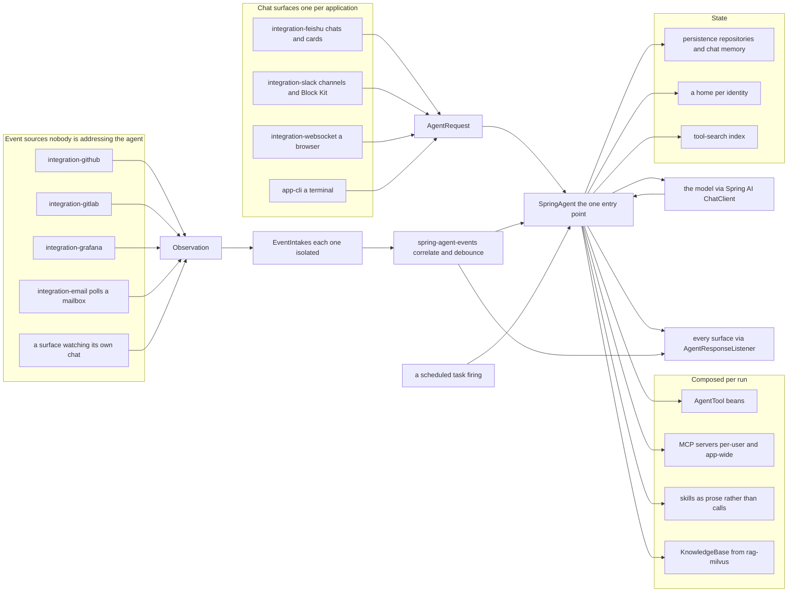
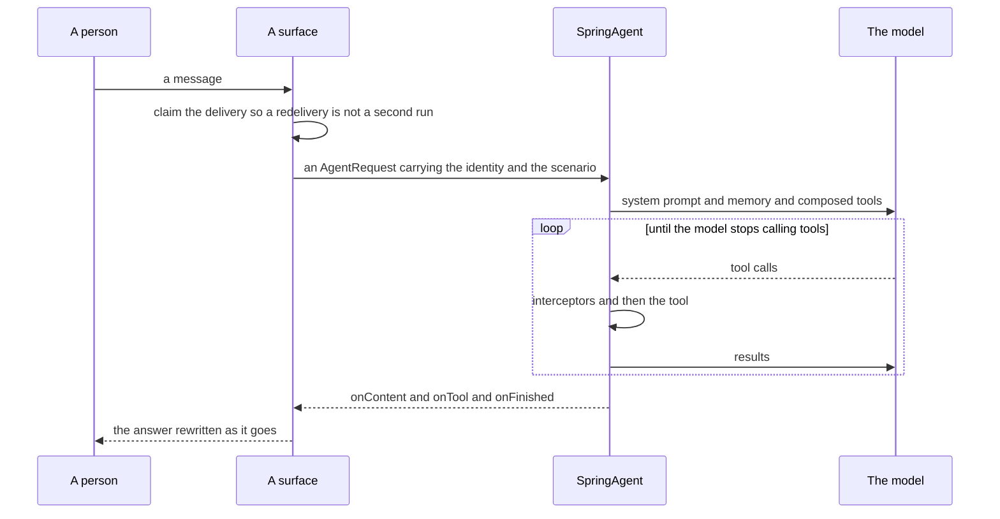
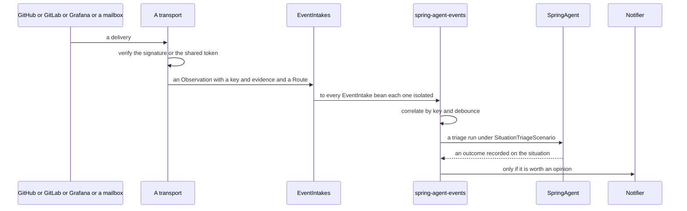
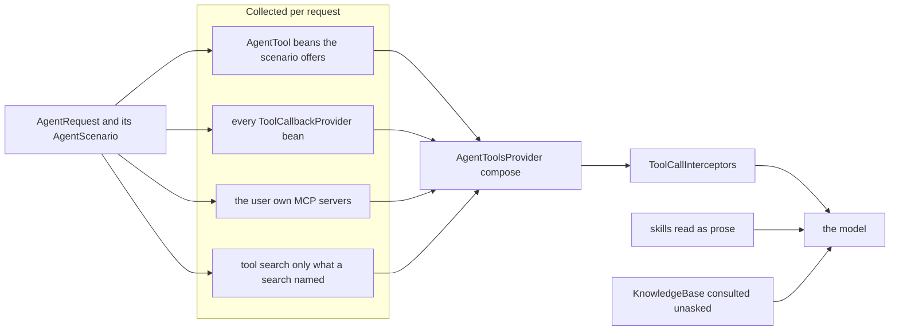
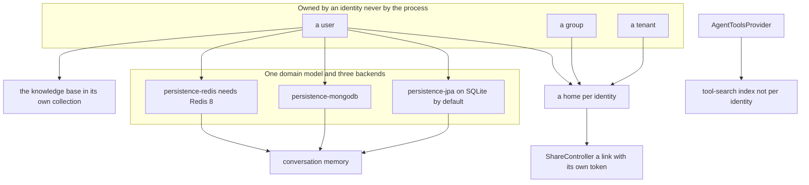
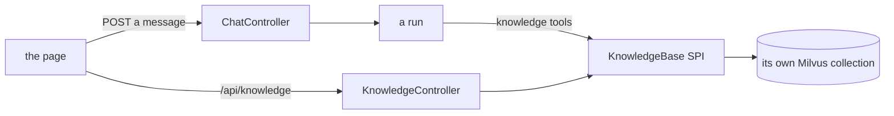
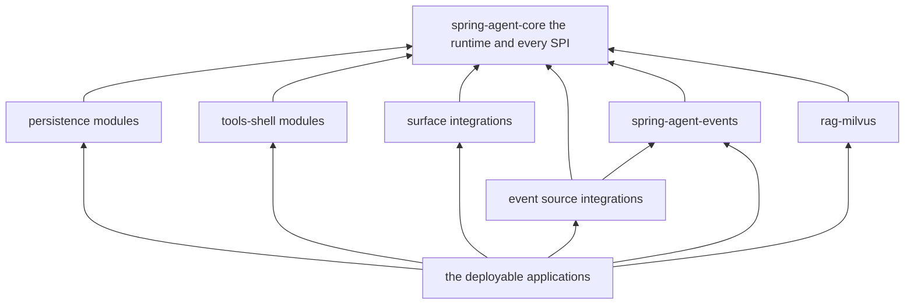

# Architecture

One picture per question, for anybody orienting themselves in this repository — before reading
[`sdk.md`](sdk.md) to embed it or [`contributing.md`](contributing.md) to change it. Every box below
is a real type or module; nothing here is aspirational. Where a diagram simplifies, the prose under
it says what it left out.

The diagrams are Mermaid, which GitHub renders in place, so they diff like the rest of the
repository. They describe *structure* — what talks to what, and what is deliberately not allowed to.
They are not a configuration reference; `spring-agent-app-feishu/src/main/resources/application.yaml`
is that.

- [The whole picture](#the-whole-picture)
- [How a run starts](#how-a-run-starts)
- [What a run is offered](#what-a-run-is-offered)
- [Where state lives](#where-state-lives)
- [What may depend on what](#what-may-depend-on-what)

## The whole picture

Two things this diagram is really saying.

**Everything funnels through one type.** A surface builds an `AgentRequest` and hands it to
`SpringAgent`; tool composition, prompt rendering, the `ChatClient` call, MCP client lifecycle,
listener fan-out and cancellation all happen inside. No integration touches `AgentToolsProvider`, an
MCP client or Reactor directly. The arrow back to the surfaces is `AgentResponseListener`, which is
how a surface follows a run — including one it did not start.

**Exactly one chat surface belongs on an application's classpath.** Three singletons in this runtime
answer for *every* run rather than for one surface's: a `@Bean AgentResponseListener`, the
`PromptVariablesContributor`s merged with `putAll`, and the `Notifier` resolved with
`getIfAvailable()`. Two surfaces means a Feishu card replied onto a Slack timestamp, and none of it
fails at startup — which is why `spring-agent-app-feishu` and `spring-agent-app-slack` are separate
applications. `spring-agent-integration-websocket` is the exception rather than a third entry: its
listener claims a run only when the request's `chatType` is `web`, and it contributes no
`{replyFormat}` and no `Notifier`, so a Feishu bot can add a browser to read its conversations in.

**`spring-agent-app-web-feishu` is what that exception is for**: one process carrying both the
browser and Feishu, so a conversation can be handed between them. Both directions need the two in
one JVM — a run journal is held in memory, and putting a browser's answer back on the chat needs a
Feishu client in the process that produced it. `chatType` is the discriminator that makes it safe:
each surface's listener declines the other's runs, Feishu's reply format answers only for `p2p` and
`group`, and only Feishu ships a `Notifier`, which is also what the mirror sends through. A second
*chat* surface there would still be the bug above.

## How a run starts

Two ways, and the second is the one that surprises people.

Nobody is talking to the agent in the second case, and that changes what a run may assume. Payload
text is written by whoever caused the event: it is **evidence, never routing and never
instructions**. A triage run assumes an identity of the agent's own rather than a person's, because
a scenario cannot withhold the files, credentials and MCP servers that come with an identity. All of
it is off unless `app.events.enabled`, and a source not named in `app.events.sources` is dropped at
the door.

A third starter is a clock: `ScheduledTaskTool` lets the agent set itself work, and a firing arrives
as a run with the `SCHEDULED_TASK` scenario, which is what keeps the scheduling tool out of it.

## What a run is offered

A run sees exactly what `AgentToolsProvider.compose(...)` returns for it — never the union of
everything present.

`AgentScenario` is the gate, and it is an interface rather than an enum so a consumer can pass their
own — `BuiltInScenarios` holds the ones shipped here. The annotation carries no scenario, because an
annotation attribute cannot have an interface type; instead `AgentScenario.offers(tool)` is asked
about every `@AgentTool` bean and says yes by default. `SUBAGENT` saying no to both `ScheduledTaskTool`
and `SubagentTools` is what caps subagent depth at one, with no counter to get wrong. A scenario also
decides whether a run uses conversation memory and whether it consults the knowledge base.

Skills are the odd one out: they are directories of prose under an identity's home, listed and
written by tools but *read* by the model as part of its context rather than invoked. That is why
`AutoSkillToolsAdvisor` only appends a paragraph inviting the model to offer one after an expensive
turn — the skill is written on a later turn, if the user says yes.

## Where state lives

`app.persistence.type` picks one column of that middle box, and it picks the conversation memory
along with the repositories so the two cannot come from different places. The filesystem tools are
confined to the homes above, so one user's agent cannot read another's files; a request naming a
`groupId` or `tenantId` also reaches those homes, which is how a group chat has skills of its own.

The **tool-search index and the knowledge base are different things**, and confusing them is the easy
mistake here. The index makes tools findable; the knowledge base is retrieval over what a user, group
or tenant asked the agent to remember, lives behind the `KnowledgeBase` SPI, and has its own Milvus
collection and connection. A deployment can run the index in the heap and the knowledge base in
Milvus.

The knowledge base is also the one store a surface reaches **without a run in between**: the browser
surface reads and writes it directly over `/api/knowledge`, on the identity of whoever is logged in.
Everywhere else a store is touched by a tool inside a run.

The scope is derived from the session in both paths and never from the request, so the page can
reach exactly what a run started from it could — with one exception, an `app.ai.admins` member
naming an owner on a read, which mirrors `KnowledgeAdminTools` and goes no further.

## What may depend on what

Every arrow points at core, and there is none between two integrations. `spring-agent-core` must
also stay free of any persistence backend — `checkRuntimeClasspathIsolation` fails the build if
Hibernate, the Mongo driver, Jedis, Milvus or fabric8 reach its runtime classpath. Where a name
genuinely has to cross that line it is duplicated as a string with a comment on both sides saying so.
